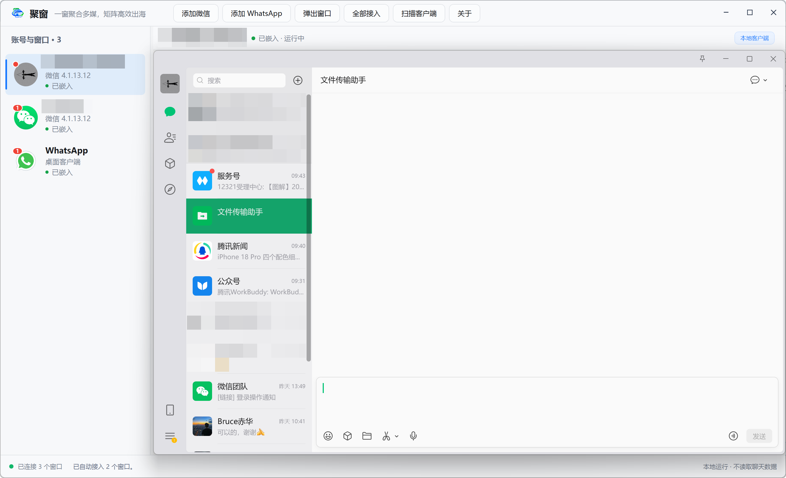
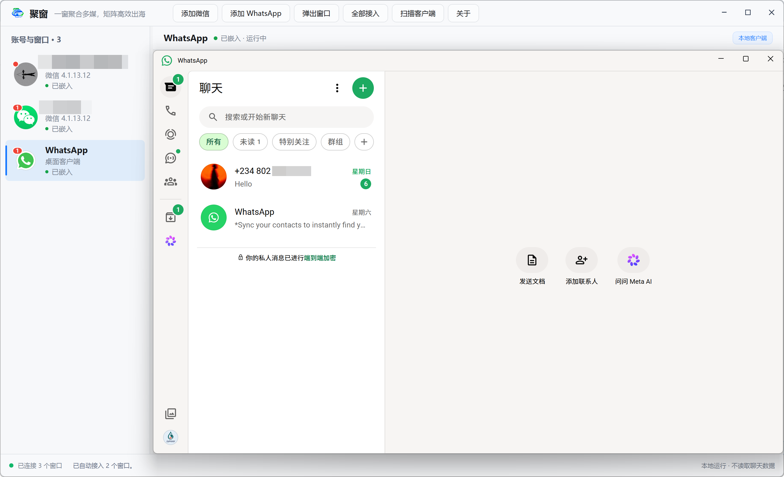

<p align="center">
  
</p>

<h1 align="center">聚窗</h1>

<p align="center">一窗聚合多媒，矩阵高效出海</p>

<p align="center">
  Windows 11 本地微信与 WhatsApp 多窗口管理器
</p>

## 项目简介

聚窗是一款面向 Windows 11 的本地桌面窗口管理工具。它可以发现、启动并统一管理电脑上已经安装的多个微信 4.x 窗口和 WhatsApp 桌面客户端，在一个主界面内完成账号切换、窗口接入、弹出和关闭。

聚窗不实现微信或 WhatsApp 的聊天协议，不接管账号登录，也不向第三方服务器上传聊天数据。客户端仍由其原生程序负责显示和交互，聚窗只负责 Windows 窗口托管与本地状态提示。

当前稳定版本：**v0.3.10**

## 软件界面

### 微信多账号统一管理

在同一界面中管理多个微信窗口，并集中查看账号状态与未读提醒。



### WhatsApp 桌面客户端接入

将 WhatsApp 桌面客户端接入聚窗，在账号列表中统一切换和查看提醒。



## 主要功能

- 同时管理多个微信 4.x 窗口和 WhatsApp 桌面客户端。
- 自动扫描并接入已经打开的客户端窗口。
- 从聚窗中启动新的微信实例或 WhatsApp。
- 在左侧账号列表中快速切换窗口。
- 一键将客户端弹出为原生独立窗口，也可重新接入。
- 嵌入后固定客户端位置，防止从容器内部拖动脱离。
- 正常关闭指定客户端，不强制结束整个进程组。
- 自动读取本地微信版本号。
- 在可可靠匹配账号时显示微信昵称和头像，并支持右键自定义名称。
- 识别微信与 WhatsApp 聊天入口的未读角标，在账号头像上显示数字或红点。
- 支持 Windows 托盘提示、提示音和任务栏提醒。
- 使用 Windows 11 风格的平面分区界面，并尽量保持客户端原生颜色与渲染效果。

## 系统要求

| 项目 | 要求 |
| --- | --- |
| 操作系统 | Windows 11 x64 |
| 微信 | 微信 4.x；主要测试版本为 4.1.13.12 |
| WhatsApp | Windows 桌面客户端 |
| 轻量版运行库 | .NET 8 Desktop Runtime x64 |
| 权限 | 建议聚窗与客户端均以普通用户权限运行 |

如果客户端以管理员身份运行，聚窗也需要使用相同权限，否则 Windows 可能阻止跨进程窗口操作。

## 下载与使用

请从 GitHub 仓库的 **Releases** 页面下载 v0.3.10，不要从不明来源获取修改版程序。

| 发布包 | 适用场景 |
| --- | --- |
| `JuChuang-v0.3.10-FrameworkDependent-win-x64.zip` | 体积小；电脑需已安装 .NET 8 Desktop Runtime x64 |
| `JuChuang-v0.3.10-SelfContained-win-x64.zip` | 体积较大；无需单独安装 .NET 运行库 |

使用步骤：

1. 解压下载的压缩包。
2. 双击 `聚窗.exe`。
3. 打开本地微信或 WhatsApp，聚窗会自动扫描并接入主窗口。
4. 使用顶部按钮添加客户端、全部接入或弹出当前窗口。
5. 使用左侧账号列表切换客户端；账号卡片右侧的关闭按钮会先请求确认。

当前发布包未进行商业代码签名，Windows SmartScreen 可能在首次运行时显示提示。请确认文件来自本仓库的 Releases 页面后再运行。

## 未读消息提示

聚窗不会读取聊天数据库来统计未读消息。它只截取客户端左侧导航栏的一小块画面，定位原生聊天角标并识别其中的数字：

- Windows 注意请求会触发即时检测。
- 程序启动后会立即校准；聚窗位于前台时每 4 秒低频复查，切换到其他程序后暂停截图，返回聚窗时立即补查。
- 发现未读后立即更新账号角标。
- 角标消失需要连续两次确认，避免客户端重绘时误清零。
- 高置信度结果显示数字，超过 99 显示 `99+`；无法可靠识别时显示红点。
- WhatsApp 会区分聊天角标与通话角标，通话、状态和归档提醒不会计入聊天未读数。

客户端界面升级后，角标的位置、颜色或字体可能改变。出现识别异常时，请在 Issue 中附上客户端版本、Windows 缩放比例和已遮挡聊天内容的界面截图。

## 隐私边界

聚窗在本机运行，不提供云端服务，也不读取或上传消息正文。

为了区分多个微信账号，程序可能执行以下只读操作：

- 读取微信进程路径和文件版本。
- 将微信进程与本地账号目录进行匹配。
- 临时读取当前账号 `contact.db` 的 SQLCipher 解密信息。
- 只查询当前登录账号本人的昵称与头像信息。
- 从该账号本地头像缓存中查找精确匹配的头像。

程序不会查询消息、会话、朋友圈等数据库。数据库密钥不写入磁盘，临时解密副本会在读取完成后删除。未读角标识别只处理客户端导航栏截图，不解析聊天内容。

## 界面与窗口托管说明

聚窗通过 Win32 和 WPF 管理外部客户端窗口。嵌入状态下会同步客户端的位置、尺寸、可见区域和激活状态；弹出时恢复客户端原生窗口样式。

微信图片、视频、文件预览和内置网页等辅助窗口不会作为账号主窗口接入。若客户端更新后改变窗口类名、渲染结构或安全策略，可能需要同步更新发现与托管规则。

## 从源码构建

准备环境：

- Windows 11 x64
- .NET 8 SDK
- Visual Studio 2022（可选，需安装 .NET 桌面开发组件）

构建主程序：

```powershell
dotnet build .\JuChuang.csproj -c Release
```

运行角标识别回归测试：

```powershell
dotnet run --project .\Tests\BadgeProbe\JuChuang.BadgeProbe.csproj -c Release
```

启动不接管本地客户端的界面预览模式：

```powershell
dotnet run --project .\JuChuang.csproj -- --preview
```

生成轻量版：

```powershell
dotnet publish .\JuChuang.csproj -c Release -r win-x64 `
  --self-contained false `
  -p:PublishSingleFile=true `
  -p:PublishReadyToRun=true
```

生成免运行库版：

```powershell
dotnet publish .\JuChuang.csproj -c Release -r win-x64 `
  --self-contained true `
  -p:PublishSingleFile=true `
  -p:PublishReadyToRun=true `
  -p:IncludeNativeLibrariesForSelfExtract=true
```

## 项目结构

```text
JuChuang/
├─ Assets/                    应用图标与客户端图标
├─ Controls/                  外部窗口托管控件
├─ docs/images/               GitHub 项目介绍截图
├─ Models/                    客户端窗口与界面状态模型
├─ Services/                  窗口发现、启动、资料读取和角标识别
├─ Tests/BadgeProbe/          未读角标识别回归测试
├─ MainWindow*.cs             主窗口、通知、托盘和角标调度
├─ MainWindow.xaml            主界面
└─ JuChuang.csproj            .NET 项目文件
```

## 版本记录

### v0.3.10

- 修复 Chrome 页面标题包含 `WhatsApp` 时被误识别并缩成左上角小窗口的问题。
- Chrome 或其他程序处于前台时暂停周期性整窗角标截图，避免硬件加速窗口闪烁。
- 切回聚窗后立即补做未读角标校准，Windows 注意请求仍保留即时检测。
- 聚窗处于后台时禁止嵌入窗口提升到全局 `HWND_TOP`，避免与前台窗口争抢层级。

### v0.3.9

- WhatsApp 角标扫描改为 DPI 感知的导航区域定位。
- 通过相邻聊天图标区分聊天角标和通话角标。
- 修复高窗口布局中漏掉聊天角标、只能显示红点的问题。
- 修复 WhatsApp 单个数字 `1` 因笔画过窄而识别失败的问题。

### v0.3.8

- 未读检测在程序启动后立即执行，并每 4 秒进行低频校准。
- Windows 消息触发期间若正在扫描，会排队补做即时检测。
- 发现未读后一次检测即可更新；清除角标需要连续两次确认。
- 选中账号时仍会同步客户端真实未读状态。

## 已知限制

- 当前仅面向 Windows 11 x64。
- 客户端升级可能改变窗口结构、昵称资料格式或角标样式。
- 跨进程窗口托管依赖 Windows 桌面窗口机制，部分特殊版本可能拒绝接入。
- 硬件加速窗口在少数显卡驱动或远程桌面环境中可能出现截图失败，此时未读提示会回退为红点或不显示。
- 微信本地资料结构变化时，昵称和头像会安全回退到通用名称与默认图标，不影响窗口管理。

## 开源许可证

Copyright 2026 JINGJIA LI

本项目采用 [Apache License 2.0](LICENSE) 授权。你可以使用、修改、分发和商用本项目，但必须遵守许可证中的版权声明保留、修改说明等条件。

## 第三方说明与免责声明

微信账号资料的只读解析参考了第三方公开研究，详情见 [THIRD-PARTY-NOTICES.md](THIRD-PARTY-NOTICES.md)。

本项目是非官方桌面工具，与腾讯、微信、WhatsApp 或 Meta 无隶属、授权或合作关系。使用者应自行遵守客户端服务条款、当地法律和所在组织的信息安全要求。
